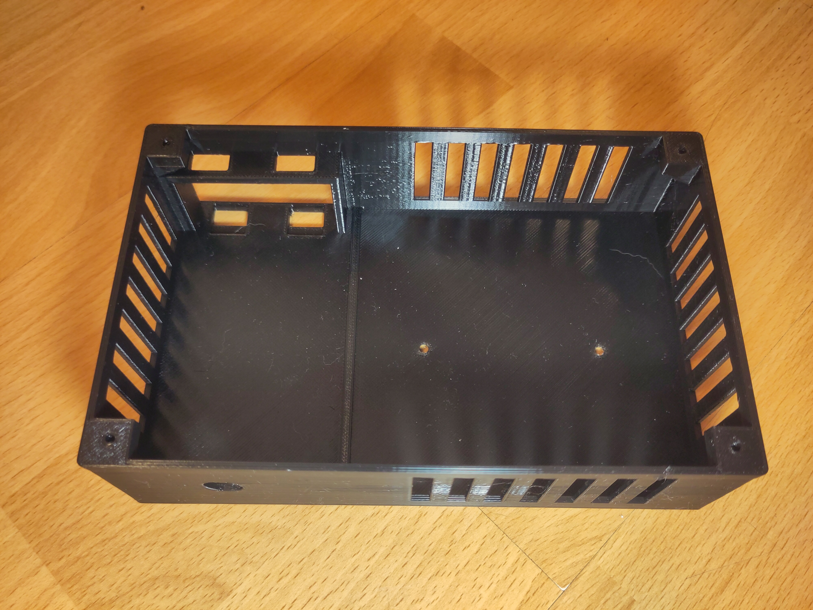
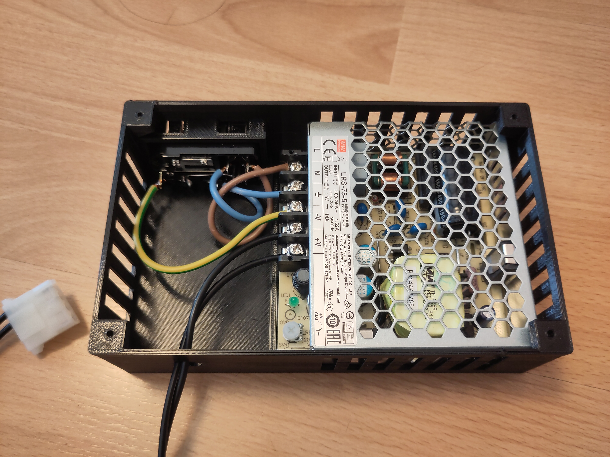
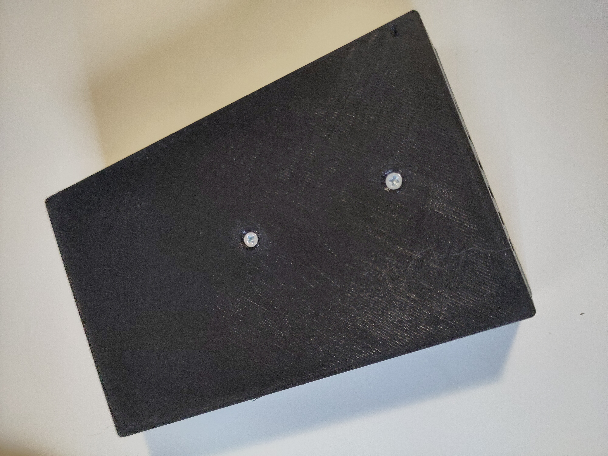
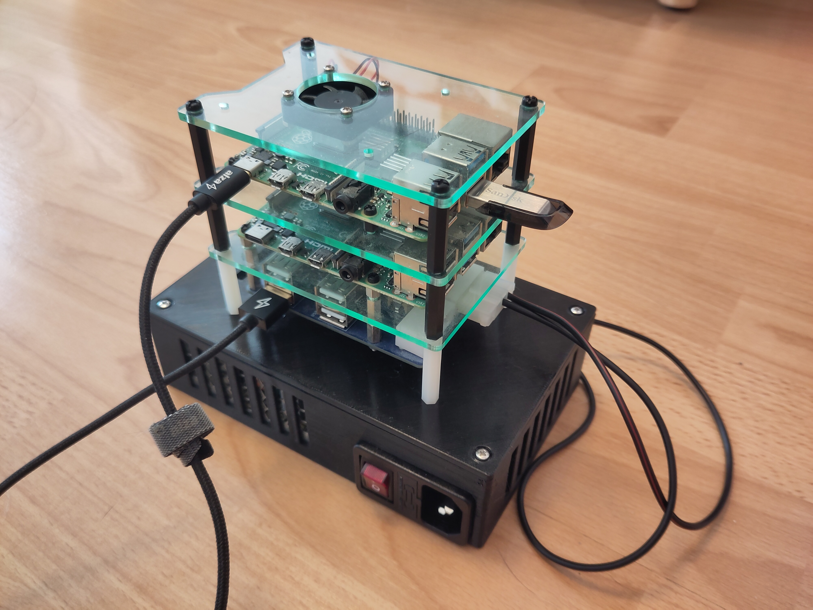

# Case for Meanwell LRS-75 switching power source

## Case
 | 
--- | --- 

## Added PSU
 | 
--- | --- 

## Final setup
 

### Note:
PSU: [Meanwell LRS-75](https://www.meanwell.com/webapp/product/search.aspx?prod=LRS-75)
Connector: [Euro connector with switch and fuse](https://www.conrad.cz/cs/p/501638-iec-zastrcka-c13-c14-zastrcka-vestavna-rovna-pocet-kontaktu-2-pe-10-a-cerna-1-ks-501638.html)